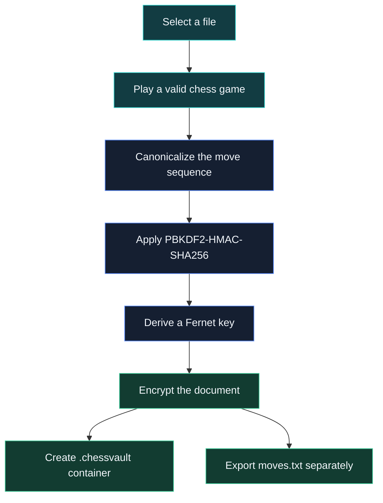
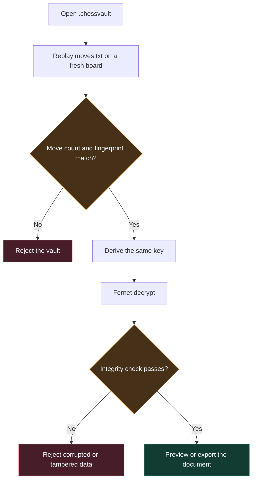
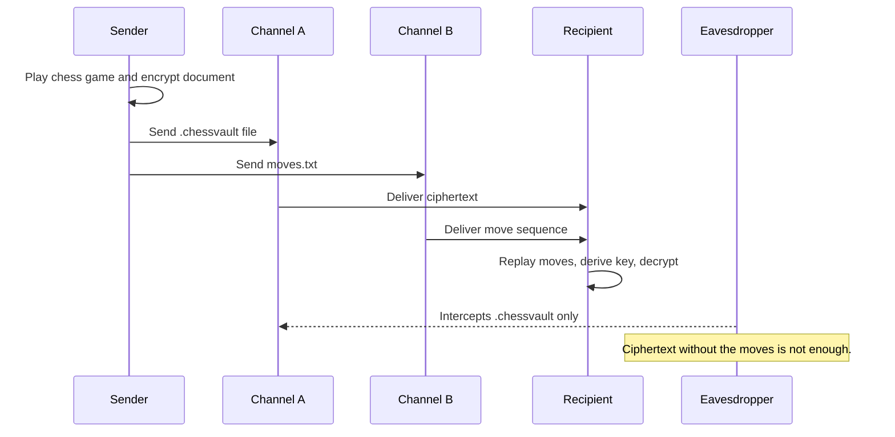
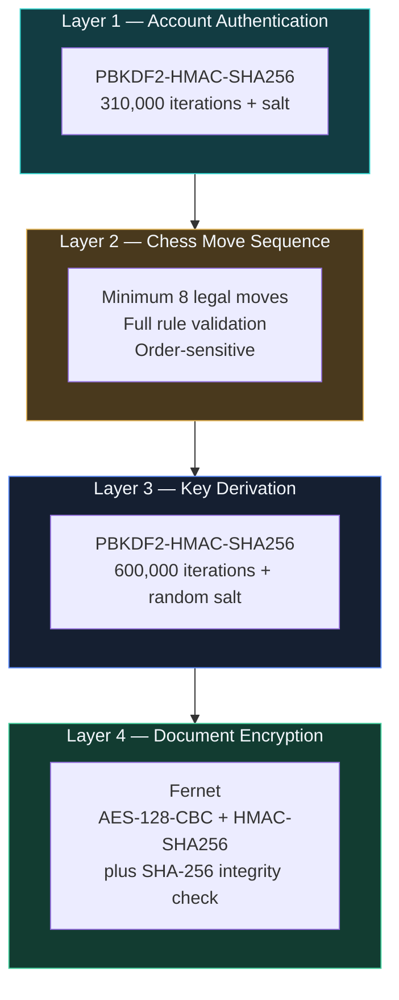

<!--
  ChessVault README
  Generated from the two source drafts and rebuilt for a cleaner GitHub presentation.
-->

<p align="center">
  
</p>

<p align="center">
  
</p>

<h1 align="center">♜ ChessVault</h1>

<p align="center">
  <b>A desktop vault that turns a legal chess game into a document encryption key.</b>
</p>

<p align="center">
  
  
  
  
  
  
</p>

<p align="center">
  <a href="#overview">Overview</a> ·
  <a href="#how-it-works">How It Works</a> ·
  <a href="#features">Features</a> ·
  <a href="#getting-started">Getting Started</a> ·
  <a href="#security-design">Security Design</a> ·
  <a href="#limitations">Limitations</a>
</p>


## Overview

ChessVault is a desktop application that encrypts documents using a reproducible sequence of **legal chess moves** rather than a typical typed password. To lock a file, the sender plays a valid chess game. That move sequence is canonicalized, strengthened with PBKDF2, and turned into the key material used to encrypt the document. To unlock the file, the recipient must replay the **exact same game**, in the same order.

This makes the project useful as a security demonstration, a cryptography exercise, and a visually distinctive final-year project.

## Why chess?

A secret does not have to be a string. It can be any repeatable sequence of decisions, provided both sides can recreate it exactly.

| Aspect | Why it matters |
|---|---|
| **Legal move validation** | Every move is checked against real chess rules, so the input must be an actual game. |
| **Order sensitivity** | The move order matters, which gives the sequence more structure than a casual password. |
| **Clear teaching value** | It is easy to explain, easy to demo, and easy to defend in a project presentation. |

> [!NOTE]
> The move sequence is the real secret. The `.chessvault` file alone decrypts nothing.

## How it works

### Sending a document



### Receiving a document



### Why the files travel separately



## Features

- Username and password authentication with PBKDF2-HMAC-SHA256 hashing.
- Separate `user` and `admin` roles.
- Full legal move validation for all six chess pieces.
- Blocked-path detection for sliding pieces.
- Sender workflow for encrypting a file into a `.chessvault` container.
- Recipient workflow for replaying moves and decrypting a received vault.
- Vault dashboard with searchable and filterable entries.
- Per-vault metadata and ownership display.
- Audit log for login, registration, and logout events.
- SHA-256 plaintext integrity verification after decrypting.
- Clean desktop UI built with `customtkinter`.

## Tech stack

| Layer | Choice |
|---|---|
| UI | `customtkinter` on top of Tkinter |
| Cryptography | `cryptography` (`Fernet`, `PBKDF2HMAC`) |
| Storage | SQLite for accounts, flat files for vaults and logs |
| Language | Python 3.11+ |

## Project structure

```text
Final_project/
├── main.py               # App shell: auth, dashboard, vault browser, admin console
├── chess_encryption.py   # Chess board UI, move validation, KDF + Fernet, vault format
├── ui_theme.py           # Color palette, fonts, reusable widgets
├── requirements.txt
├── assets/               # Icons and logo
└── spy_documents/        # Runtime data created on first launch
    ├── users.db
    ├── logs.txt
    └── *.chessvault
```

## Getting started

### Prerequisites

- Python 3.11 or newer
- `pip`

### Installation

```bash
git clone <your-repo-url>
cd Final_project

python3 -m venv .venv
source .venv/bin/activate      # Windows: .venv\Scripts\activate

python3 -m pip install --no-cache-dir -r requirements.txt

python3 main.py
```

On first launch, ChessVault creates `spy_documents/`, initializes the SQLite database, and seeds a default admin account.

## Usage

### To send a document

1. Log in and choose **Encrypt a document**.
2. Select a file that is not already a `.chessvault`.
3. Play at least 8 legal moves on the board.
4. The app creates a `.chessvault` file and exports a matching `moves.txt`.
5. Send the two files to the recipient over different channels.

### To receive a document

1. Choose **Open a received vault** and select the `.chessvault` file.
2. Replay the moves from `moves.txt` in order.
3. If the move sequence matches, preview the document or export a decrypted copy.

## Default admin account

| Field | Value |
|---|---|
| Username | `admin` |
| Password | `admin123` |
| Role | `admin` |

> [!WARNING]
> Change the password before using ChessVault with real data. These credentials exist only to make the app usable out of the box.

## Security design

| Parameter | Value | Purpose |
|---|---|---|
| Password hashing | PBKDF2-HMAC-SHA256, 310,000 iterations, 16-byte random salt | Protects stored account passwords |
| Vault key derivation | PBKDF2-HMAC-SHA256, 600,000 iterations, 16-byte random salt, input = canonicalized move bytes | Turns a chess game into a key |
| Document encryption | Fernet, backed by AES-128-CBC + HMAC-SHA256 | Authenticated encryption of the document bytes |
| Minimum move count | 8 legal moves | Prevents trivially short sequences |
| Sequence fingerprint | SHA-256 of canonical moves, truncated to 16 hex chars | Quickly rejects the wrong move sequence |
| Plaintext integrity | SHA-256 of the original document | Detects corruption or tampering after decrypt |

### Security layers



## Vault file format

Each `.chessvault` file is a small custom container:

```text
┌─────────────────────────────┬───────────────┬────────────────────┬──────────────────┐
│ "CHESSVAULT" + version byte │ header length │ JSON metadata       │ Fernet token     │
│         (11 bytes)          │ (4-byte uint) │ (UTF-8, size above) │ (rest of file)   │
└─────────────────────────────┴───────────────┴────────────────────┴──────────────────┘
```

The metadata includes the original filename, owner, creation time, KDF parameters, salt, move count, sequence fingerprint, and the plaintext SHA-256 hash. It contains everything required to attempt a decrypt, but nothing that lets a vault open without the moves.

## What is excluded from version control

The `.gitignore` file should keep runtime and sensitive data out of the repository.

| Excluded | Why |
|---|---|
| `spy_documents/`, `secure_storage/`, `documents/` | Runtime databases, logs, and real encrypted vaults |
| `*.db`, `logs.txt`, `*.chessvault` | User accounts, audit history, and encrypted payloads |
| `*_moves.txt`, `*move_sequence*.txt`, `*chess_key*.txt`, `recovery_keys/` | Decryption secrets in plain text |
| `.venv/`, `__pycache__/` | Local environment and build artifacts |

## Limitations

> [!CAUTION]
> The moves file is the real secret. Anyone holding both the `.chessvault` file and `moves.txt` can decrypt it. Treat `moves.txt` like a password.

| Limitation | Impact |
|---|---|
| PBKDF2 strengthens the key derivation, it does not create entropy | A short, predictable opening is weaker than a longer, unusual one. |
| Single-machine trust model | Login protects the UI, not the filesystem. Direct access to runtime data bypasses the account layer. |
| No built-in public-key wrapping | Sharing the moves file is still a manual, out-of-band step. |

## Roadmap

- Public-key wrapping for recipient-specific key delivery.
- Optional vault expiry or one-time-use decryption.
- Per-vault audit trails.
- Multi-user sharing without resending the moves file.
- Optional export of a concise project report from the app itself.


## Contributing

Pull requests are welcome. Keep changes focused, readable, and aligned with the current architecture.

1. Fork the repository.
2. Create a branch.
3. Make your changes.
4. Test the application.
5. Submit a pull request.


## Author

ChessVault was created as a cyber security final-year project by Iqbal.

<p align="center">
  <sub>ChessVault, 2026</sub>
</p>
                             ♜ ChessVault
       A desktop vault that turns a legal chess game into a document
                              encryption key.

version 1.0.0 | Python 3.11+ | MIT License | Active | PRs welcome

           Concept • Why Chess? • How It Works • Features •
               Quick Start • Security • Limitations


CONCEPT
-------
ChessVault uses a chess game as the "password" for a document. To lock a
file, you play a sequence of legal moves on a real chess board. Those
moves are canonicalised, run through PBKDF2, and used to derive the key
that encrypts the document. To unlock it, someone must replay the exact
same game in the correct order.


WHY A CHESS BOARD?
------------------
A secret doesn't have to be a string – it can be any reproducible
sequence of decisions, as long as both sides can recreate it exactly.

| Aspect                   | Why It Matters                                      |
|--------------------------|-----------------------------------------------------|
| Legal Move Validation    | Every move is checked against real chess rules –    |
|                          | no arbitrary noise.                                 |
| Order Sensitivity        | Move order is easy to write down but hard to guess, |
|                          | especially past a handful of moves.                 |
| Teachable Security       | It demonstrates why the approach is secure, a       |
|                          | useful discussion point for a security project.     |

Note: See LIMITATIONS section for where the idea holds up and where it
doesn't.


HOW ENCRYPTION WORKS
--------------------

Locking a Document (Sender Side)

🎮 Play ≥ 8 legal moves
        │
        ▼
📝 Canonicalize moves → "0001:e2>e4\n0002:e7>e5\n..."
        │
        ▼
🔑 PBKDF2-HMAC-SHA256, 600,000 iterations, random 16-byte salt
        │
        ▼
🔐 Fernet key (AES-128-CBC + HMAC-SHA256)
        │
        ▼
📦 Encrypt the document → <owner>_<name>.chessvault
        │
        └────────────────────────────────────► 📄 moves.txt
                                              (shared out-of-band)

Unlocking a Document (Recipient Side)

📂 Open .chessvault file
        │
        ▼
♟️ Replay moves from moves.txt on a fresh board
        │
        ▼
🔍 Check move count + SHA-256 fingerprint
        │
        ├── ✅ Match ──► 🔑 Derive key via PBKDF2
        │                     │
        │                     ▼
        │                 🔓 Fernet decrypt
        │                     │
        │                     ▼
        │                 ✅ SHA-256 integrity check
        │                     │
        │                     ▼
        │                 📄 Preview/Export document
        │
        └── ❌ Mismatch ──► 🚫 "These moves don't match this vault"

Key point: The move sequence is the secret. The .chessvault file alone
decrypts nothing. Share the .chessvault and moves.txt files over different
channels.


FEATURES
--------
| Area                 | Description                                       |
|----------------------|---------------------------------------------------|
| Accounts             | Username/password registration with PBKDF2-HMAC-  |
|                      | SHA256 hashing (310,000 iterations, per-user      |
|                      | salt). Legacy SHA-256 hashes are upgraded on      |
|                      | next login.                                       |
| Roles                | 'user' and 'admin' roles, selected at login and   |
|                      | enforced independently.                           |
| Chess Engine         | Full legal-move validation for all piece types,   |
|                      | including blocked-path detection.                 |
| Dashboard            | Live stats (vault count, storage used, access     |
|                      | level), searchable/filterable vault browser,      |
|                      | per-vault metadata.                               |
| Encryption Workflow  | Pick a file, play a game, get a .chessvault and   |
|                      | matching moves.txt.                               |
| Decryption Workflow  | Open a .chessvault, replay the moves, preview or  |
|                      | export the decrypted document.                    |
| Admin Console        | Read-only audit log of logins, registrations,     |
|                      | logouts; ability to delete any vault; owner       |
|                      | visibility on each vault card.                    |
| Integrity            | Every decryption checks a stored SHA-256 hash of  |
|                      | the original plaintext, independent of Fernet's   |
|                      | own authentication.                               |


TECH STACK
----------
| Layer         | Choice                                             |
|---------------|----------------------------------------------------|
| UI            | customtkinter on top of Tkinter                    |
| Cryptography  | cryptography (Fernet, PBKDF2HMAC)                  |
| Storage       | SQLite (accounts), flat files (.chessvault, logs)  |
| Language      | Python 3.11+                                       |


PROJECT LAYOUT
--------------
Final_project/
├── main.py               # App shell: auth, dashboard, vault browser, admin
├── chess_encryption.py   # Chess board UI, move validation, KDF + Fernet, vault format
├── ui_theme.py           # Color palette, fonts, reusable widgets
├── requirements.txt
├── assets/               # Icons and logo
└── spy_documents/        # Runtime data – created on first launch, gitignored
    ├── users.db
    ├── logs.txt
    └── *.chessvault


QUICK START
-----------
Prerequisites:
- Python 3.11 or newer
- pip

Installation:
  1. Clone the repository
     git clone <this-repo-url>
     cd Final_project

  2. Create and activate a virtual environment (recommended)
     python3 -m venv .venv
     source .venv/bin/activate         # Windows: .venv\Scripts\activate

  3. Install dependencies
     python3 -m pip install --no-cache-dir -r requirements.txt

  4. Run the application
     python3 main.py

On first launch, ChessVault creates spy_documents/, initialises the SQLite
database, and seeds a default admin account (see below).


DEFAULT ADMIN ACCOUNT
---------------------
Username: admin
Password: admin123
Role:     admin

Important: Change the password or recreate the account before using
ChessVault with real data. The seeded credentials are not secret.


USAGE
-----
Sending a Document
  1. Log in and select "Encrypt a document".
  2. Pick any file (not already a .chessvault).
  3. Play at least 8 legal moves on the board.
  4. A .chessvault file is written to the vault and a moves.txt is exported.
  5. Share both files with the recipient – but never over the same channel.

Receiving a Document
  1. Select "Open a received vault" and choose the .chessvault file.
  2. Replay the moves from moves.txt in order.
  3. On success, preview the document or export a decrypted copy.

Vault cards also offer Export (copy the raw .chessvault container) and,
for admins, Delete.


SECURITY DESIGN
---------------
| Parameter               | Value                    | Purpose                         |
|-------------------------|--------------------------|---------------------------------|
| Password Hashing        | PBKDF2-HMAC-SHA256,      | Protects stored account         |
|                         | 310,000 iterations,      | passwords                       |
|                         | 16-byte random salt      |                                 |
| Vault Key Derivation    | PBKDF2-HMAC-SHA256,      | Turns a chess game into a       |
|                         | 600,000 iterations,      | 256-bit key                     |
|                         | 16-byte random salt,     |                                 |
|                         | input = canonicalized    |                                 |
|                         | move bytes               |                                 |
| Document Encryption     | Fernet → AES-128-CBC +   | Authenticated encryption of     |
|                         | HMAC-SHA256              | the document                    |
| Minimum Move Count      | 8 legal moves            | Floor on key-derivation input   |
|                         |                          | length                          |
| Sequence Fingerprint    | SHA-256 of canonical     | Stored unencrypted in metadata  |
|                         | moves, truncated to      | only to quickly reject a wrong  |
|                         | 16 hex chars             | move sequence                   |
| Plaintext Integrity     | SHA-256 of the original  | Catches corruption or tampering |
|                         | document, checked after  | beyond Fernet's own MAC         |
|                         | every decrypt            |                                 |

Security Layers

 ┌───────────────────────────────────────────────────────────────────────┐
 │                         SECURITY LAYERS                              │
 ├───────────────────────────────────────────────────────────────────────┤
 │                                                                       │
 │  ┌─────────────────────────────────────────────────────────────────┐ │
 │  │   🔐 LAYER 1: Account Authentication                           │ │
 │  │   PBKDF2-HMAC-SHA256 (310,000 iterations + salt)              │ │
 │  └─────────────────────────────────────────────────────────────────┘ │
 │                                    ▼                                  │
 │  ┌─────────────────────────────────────────────────────────────────┐ │
 │  │   ♟️ LAYER 2: Chess Move Sequence (The Real Secret)            │ │
 │  │   Minimum 8 moves · Full legal validation · Order-sensitive    │ │
 │  └─────────────────────────────────────────────────────────────────┘ │
 │                                    ▼                                  │
 │  ┌─────────────────────────────────────────────────────────────────┐ │
 │  │   🔑 LAYER 3: Key Derivation                                   │ │
 │  │   PBKDF2-HMAC-SHA256 (600,000 iterations + random salt)       │ │
 │  └─────────────────────────────────────────────────────────────────┘ │
 │                                    ▼                                  │
 │  ┌─────────────────────────────────────────────────────────────────┐ │
 │  │   📦 LAYER 4: Document Encryption                              │ │
 │  │   Fernet (AES-128-CBC + HMAC-SHA256) + SHA-256 integrity      │ │
 │  └─────────────────────────────────────────────────────────────────┘ │
 │                                                                       │
 └───────────────────────────────────────────────────────────────────────┘

===========================================================================

VAULT FILE FORMAT
-----------------
Each .chessvault file is a binary container:

 ┌──────────────────────────┬───────────────┬───────────────────┬──────────────────┐
 │ "CHESSVAULT" + version   │ header length │ JSON metadata     │ Fernet token     │
 │         byte (11 bytes)  │ (4-byte uint) │ (UTF-8, size      │ (rest of file)   │
 │                          │               │ above)            │                  │
 └──────────────────────────┴───────────────┴───────────────────┴──────────────────┘

The JSON metadata includes: original filename, owner, creation time, KDF
parameters, salt, move count, sequence fingerprint, and plaintext SHA-256
hash.

===========================================================================

EXCLUDED FROM VERSION CONTROL
-----------------------------
.gitignore excludes all runtime and sensitive data:

| Excluded pattern                                  | Reason                    |
|---------------------------------------------------|---------------------------|
| spy_documents/, secure_storage/, documents/       | Runtime databases, logs,  |
|                                                   | real encrypted vaults     |
| *.db, logs.txt, *.chessvault                     | User accounts, audit      |
|                                                   | history, encrypted        |
|                                                   | payloads                  |
| *_moves.txt, *move_sequence*.txt,                 | Decryption secrets        |
| *chess_key*.txt, recovery_keys/                   |                           |
| .venv/, __pycache__/                              | Local environment and     |
|                                                   | build artifacts           |

===========================================================================

LIMITATIONS
-----------
| Limitation                         | Impact                                       |
|------------------------------------|----------------------------------------------|
| moves.txt is the real secret       | Anyone holding both the .chessvault and      |
|                                    | moves.txt can decrypt. Treat moves.txt like  |
|                                    | a password – never share it over the same    |
|                                    | channel as the vault file.                   |
| PBKDF2 strengthens, doesn't create | A short, well‑known opening is weaker than a |
| entropy                            | longer, unusual one.                         |
| Single‑machine trust model         | Login controls the UI, not filesystem access.|
|                                    | Direct access to spy_documents/ bypasses the |
|                                    | account layer.                               |
| No key wrapping between users      | Sharing the moves file remains a manual,     |
|                                    | out‑of‑band step for every document.         |

===========================================================================

POSSIBLE NEXT STEPS
-------------------
| Feature                  | Description                                  |
|--------------------------|----------------------------------------------|
| Public Key Wrapping      | Wrap the derived key with the recipient's    |
|                          | public key so the move sequence never leaves |
|                          | the sender's machine.                        |
| Vault Expiry             | Optional one‑time‑use decryption or time‑    |
|                          | limited vaults.                              |
| Per‑Vault Audit Trails   | Track access history per vault rather than a |
|                          | single global log.                           |
| Multi‑User Sharing       | Share a vault with multiple recipients       |
|                          | without resending the moves file.            |

===========================================================================

© 2026 ChessVault Project# 🎯 Improved README.md for ChessVault


